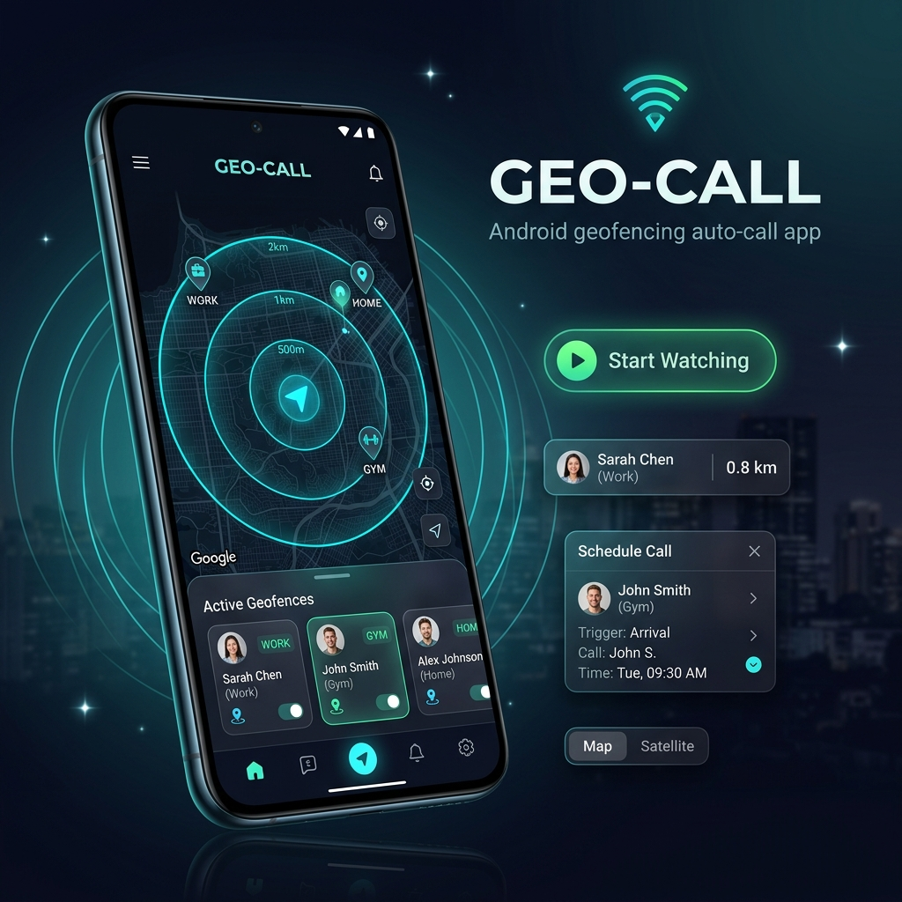

<p align="center">
  
</p>

# GeoCall — Android Auto-Call Location & Scheduling App


A premium, fully featured Android application that:
1. **Automatically places a phone call** (or triggers a manual call overlay) when you enter a set geographic radius.
2. **Schedules phone calls at specific times**, executing them natively in the background even if the app is closed or the phone is asleep.

The app runs a persistent Kotlin-based foreground service for continuous GPS tracking and utilizes a glassmorphic web-based UI built with Leaflet for map interactions.

---

## 📸 App Architecture & Flow

```
┌──────────────────────────────────────┐
│           MainActivity.kt            │
│  ┌────────────────────────────────┐  │
│  │     WebView (geocall.html)     │  │
│  │     Leaflet Map + Controls     │  │
│  └────────────────────────────────┘  │
│          NativeBridge Interface      │
└──────────────┬────────────────┬──────┘
               │                │
               │ (Geofences)    │ (Scheduled Call)
┌──────────────▼───────┐┌───────▼──────────────┐
│  GeoWatchService.kt  ││   CallScheduler.kt   │
│  ✦ 3s GPS Tracking   ││   (AlarmManager API) │
│  ✦ Distance Check    │└───────┬──────────────┘
│  ✦ TTS & Vibration   │        │ Triggers alarm
│  ✦ ACTION_CALL       │┌───────▼──────────────┐
└──────────────────────┘│  CallAlarmReceiver   │
                        │  ✦ ACTION_CALL       │
                        └──────────────────────┘
```

---

## ✨ Key Features

1. **Persistent Location Tracking**
   - Utilizes `FusedLocationProviderClient` for high-accuracy GPS coordinates every 3 seconds.
   - Runs as a **Foreground Service** to prevent Android system sleep termination.
   - Acquires a `WakeLock` so tracking remains active even when the screen is off.

2. **Auto Call vs. Manual Modes**
   - **Auto Call ON**: Automatically places the phone call via `Intent.ACTION_CALL` after entering the geofence radius.
   - **Auto Call OFF**: Vibrates, plays TextToSpeech alerts, and presents a visual "Call Now" overlay in the map HUD.

3. **Background Scheduled Calls**
   - Allows users to schedule a call to any contact at a specific time.
   - Uses Android's native **`AlarmManager` API** (`setExactAndAllowWhileIdle`) to ensure the call is placed reliably even if the app is force-closed, device is sleeping, or in Doze mode.

4. **Premium Map & Autocomplete Search**
   - Interactive OpenStreetMap view with a dark, Uber-like CartoDB theme.
   - Integrated **Photon API** (Elasticsearch based, fast autocompletion, no query limitations) as the primary geocoding search, with a robust fallback to **Nominatim** if the network request fails.
   - Live simulated walking mode (walk virtual marker to target destination).
   - Dynamic tracking HUD showing nearest contact, distance remaining, and journey progress bar.

5. **Ergonomic Layout & Bottom Sheet**
   - Capped at **65% height max**, leaving 35% of the screen always displaying the map.
   - Smart pull-down gestures: Simply swipe down on the list body when at the top to slide the sheet down.

6. **Dual-SIM Slot Picker**
   - Directly choose to place calls through **SIM 1**, **SIM 2**, or the **System Default SIM**.

7. **Speech & Haptics**
   - Generates haptic wave vibration patterns when entering geofence boundaries.
   - Speaks context-aware announcements (e.g. *"Arriving near Ajay. Auto calling now."*) using Android TextToSpeech.

---

## 📂 Project Structure

```
d:\geo-call\
├── android-app/                       # Root Android Studio project
│   ├── app/
│   │   ├── src/main/
│   │   │   ├── AndroidManifest.xml   # Permission declarations, receiver, & service registry
│   │   │   ├── assets/
│   │   │   │   └── geocall.html       # Web interface (Leaflet Map, CSS styling, UI logic, Photon search)
│   │   │   ├── java/com/example/geocall/
│   │   │   │   ├── MainActivity.kt    # WebView host, Permission handler & JS NativeBridge
│   │   │   │   ├── GeoWatchService.kt # Foreground service (GPS, TTS, AutoCall logic)
│   │   │   │   ├── CallScheduler.kt   # Native Android AlarmManager scheduler
│   │   │   │   ├── CallAlarmReceiver.kt # BroadcastReceiver for scheduled calls
│   │   │   │   └── GeofenceData.kt    # Geofence model & JSON parsing
│   │   │   └── res/                   # App resources, customized launcher icons
│   │   └── build.gradle.kts           # Gradle module build configuration
│   └── settings.gradle.kts            # Project settings
├── geocall.apk                        # Compiled ready-to-use application binary
└── README.md                          # Project overview & documentation
```

---

## 🚀 How to Build & Run

### Prerequisites
- Android SDK installed.
- Android device connected via USB with **USB Debugging** enabled in Developer Options.

### 1. Build and Install using Gradle Wrapper
Run the following command in the `android-app/` directory:
```powershell
# Windows
.\gradlew.bat installDebug
```

### 2. Launch the Application via ADB
If the app does not open automatically, launch it using:
```powershell
& "C:\Users\ajay6\AppData\Local\Android\Sdk\platform-tools\adb.exe" shell am start -n com.example.geocall/.MainActivity
```

---

## ⚙️ Required Permissions

To run correctly, the app requests the following system permissions:

| Permission | Purpose |
| :--- | :--- |
| `CALL_PHONE` | Places calls directly without redirecting to the dialer interface. |
| `ACCESS_FINE_LOCATION` | Precise GPS-based location tracking. |
| `ACCESS_BACKGROUND_LOCATION` | Track location when screen is off or app minimized. |
| `FOREGROUND_SERVICE_LOCATION` | Required to run location services in the foreground on Android 10+. |
| `WAKE_LOCK` | Keeps the CPU awake during active foreground tracking. |
| `VIBRATE` | Device vibration feedback on entering target boundaries. |
| `POST_NOTIFICATIONS` | Displays the persistent tracking notification on Android 13+. |
| `SCHEDULE_EXACT_ALARM` | Ensures precision execution of scheduled call timers in Android 12+. |

---

## 🧪 Simulation Mode (For easy testing)

Since you cannot easily travel to test geofence triggers:
1. Open the app and grant location/call permissions.
2. Search a place or tap the map to place a pin.
3. Enter a mock contact name, phone number, select a radius, and tap **+ Add Geofence**.
4. Enable **Simulation Mode** (🧪 toggle at the bottom).
5. Tap **Start Watching**.
6. Tap **Simulate Walk to Target** or manually tap somewhere on the map to jump your simulated position inside the radius to trigger the haptic feedback, announcement, and call!
